# 🏠 House Price Prediction — MLOps Project

An end-to-end machine learning system for predicting residential property prices using the Ames Housing dataset.

This project covers the complete machine learning lifecycle: data validation, data cleaning, exploratory analysis, feature engineering, preprocessing, model comparison, hyperparameter tuning, final evaluation, model saving, API integration, containerization, and web deployment.

<!--  --> https://house-price-mlops-1-pp8g.onrender.com

## 📊 Final Model Performance

The final model is a tuned **Ridge Regression** pipeline evaluated on a held-out test set.

| Metric | Result |
|---|---:|
| Cross-validation RMSE | **0.1142** |
| Test RMSE — log scale | **0.1205** |
| Test R² — log scale | **0.9147** |
| Test MAE — original price | **$13,908** |
| Test RMSE — original price | **$19,154** |
| Test R² — original price | **0.9332** |

The model explains approximately **93.32% of the variation in house prices** on the held-out test set.

## 🎯 Project Objective

The objective is to predict the sale price of a residential property using its structural, quality, location, and amenity-related features.

The target variable was transformed using:

```python
SalePrice_log = np.log1p(SalePrice)
```

Predictions are converted back to dollar values using:

```python
SalePrice = np.expm1(prediction)
```

## 🔄 ML Workflow

```mermaid
flowchart LR
    A[Raw Ames Dataset] --> B[Data Validation]
    B --> C[Cleaning and Missing Values]
    C --> D[Feature Engineering]
    D --> E[Train/Test Split]
    E --> F[Preprocessing Pipeline]
    F --> G[Model Comparison]
    G --> H[Ridge Hyperparameter Tuning]
    H --> I[Final Evaluation]
    I --> J[Saved Model Pipeline]
    J --> K[Gradio UI and Render Deployment]
```



## 🤖 Model Comparison

Five regression models were compared using five-fold cross-validation.

| Model | CV RMSE |
|---|---:|
| **Ridge Regression** | **0.1195** |
| XGBoost | 0.1201 |
| CatBoost | 0.1203 |
| HistGradientBoosting | 0.1281 |
| Random Forest | 0.1328 |

Ridge Regression was selected because it achieved the lowest initial cross-validation error, trained quickly, and handles correlated features through L2 regularization.

After hyperparameter tuning, Ridge improved from **0.1195** to **0.1142 CV RMSE**.

## 🧠 Feature Engineering

The project includes the following engineered features:

- `TotalSF`
- `TotalBathrooms`
- `HouseAge`
- `RemodAge`
- `GarageAge`
- `TotalPorchArea`
- `TotalQualityScore`
- `QualityLivingArea`
- `HasPool`
- `HasGarage`
- `HasFireplace`
- `Has2ndFloor`
- `HasBsmt`

## 🛠️ Tech Stack

- **Language:** Python
- **Data Processing:** pandas, NumPy
- **Modeling:** scikit-learn, XGBoost, CatBoost
- **Final Model:** Ridge Regression
- **Experimentation:** Jupyter Notebook
- **API:** FastAPI
- **Frontend:** Gradio
- **Model Serialization:** joblib
- **Containerization:** Docker
- **Version Control:** Git and GitHub
- **Deployment:** Render
- **MLOps Tools:** DVC and MLflow, where configured

## 📁 Project Structure

```text
house-price-mlops/
├── data/
│   ├── raw/
│   └── processed/
├── notebooks/
│   ├── 01_data_understanding.ipynb
│   ├── 02_data_cleaning.ipynb
│   ├── 03_eda.ipynb
│   ├── 04_missing_values.ipynb
│   ├── 05_outliers.ipynb
│   ├── 06_data_validation.ipynb
│   ├── 07_feature_engineering.ipynb
│   ├── 08_train_test_split.ipynb
│   ├── 09_preprocessing.ipynb
│   ├── 10_baseline_model.ipynb
│   ├── 11_model_comparison.ipynb
│   ├── 12_hyperparameter_tuning.ipynb
│   ├── 13_feature_selection.ipynb
│   ├── 14_error_analysis.ipynb
│   ├── 15_final_model.ipynb
│   └── 16_model_saving.ipynb
├── models/
│   ├── house_price_pipeline.pkl
│   ├── ridge_tuned_pipeline.pkl
│   └── final_model_report.csv
├── src/
│   └── predict.py
├── api/
├── frontend/
├── Dockerfile
├── requirements.txt
├── PROJECT_LOG.md
└── README.md
```

## 🚀 Run Locally

### 1. Clone the repository

```bash
git clone YOUR_GITHUB_REPOSITORY_URL
cd house-price-mlops
```

### 2. Create and activate the virtual environment

For macOS/Linux:

```bash
python3 -m venv venv
source venv/bin/activate
```

For Windows:

```powershell
python -m venv venv
venv\Scripts\activate
```

### 3. Install dependencies

```bash
pip install -r requirements.txt
```

### 4. Run the Gradio application

```bash
python frontend/app.py
```

Open:

```text
http://localhost:10000
```

### 5. Run the FastAPI service

```bash
uvicorn api.main:app --reload
```

Open the interactive API documentation:

```text
http://localhost:8000/docs
```

### 6. Run with Docker

```bash
docker build -t house-price-api .
docker run -p 8000:8000 house-price-api
```

### 7. View MLflow experiments

```bash
mlflow ui --backend-store-uri sqlite:///mlflow.db
```

Open:

```text
http://localhost:5000
```

## 🧪 Reproducibility

The complete workflow is documented in notebooks `01` through `16`.

The saved model pipeline includes:

1. Numerical imputation
2. Categorical imputation
3. Numerical scaling
4. One-hot encoding
5. Tuned Ridge Regression
6. Log-price prediction conversion

The deployed application loads:

```text
models/house_price_pipeline.pkl
```

## ⚠️ Limitations

- The model is trained on the Ames Housing dataset and may not generalize to every location.
- Predictions depend on the completeness and accuracy of the input features.
- The system is intended for educational and demonstration purposes.
- Predictions should not be treated as formal property valuations.
- Regression performance should be evaluated using RMSE, MAE, and R² rather than classification accuracy.

## 📚 Dataset

[Ames Housing Dataset — Kaggle](https://www.kaggle.com/c/house-prices-advanced-regression-techniques/data)

## 👩‍💻 Author

**Kovardhini**

Machine Learning and MLOps Project
